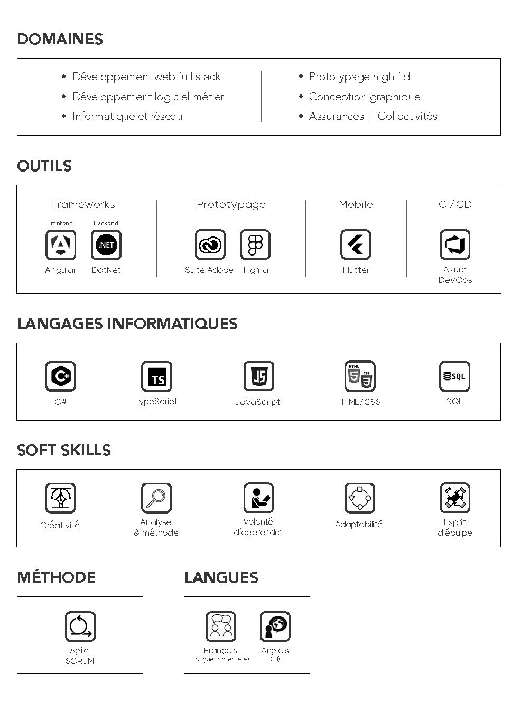

👋 Hi, I’m Mathieu

# **About me**

Infographiste Print/Web de formation initiale, j’ai évolué dans la communication et l’informatique pendant près de 19 ans. Mes appétences pour le numérique m’ont motivé à me reconvertir tout d’abord dans le design d’interfaces puis dans le développement d’applications, d’avril 2022 à février 2024.

Diplômé d’un Titre de Concepteur Développeur d’Applications (bac+4/niv.6) en 2024 et après une première expérience en entreprise dans le domaine de l’assurance au poste de Développeur Informatique Junior, je maîtrise les fondamentaux du développement applicatif web, notamment sur les frameworks Angular et .NET, ainsi que les langages TypeScript et C#.

**Je suis désormais à la recherche d’une nouvelle aventure professionnelle dans ce passionnant domaine qu’est le code !**

---

Originally trained as a Print/Web graphic designer, I worked in communications and IT for almost 19 years. My interest in the digital world led me to retrain, first in interface design, then in application development, from April 2022 to February 2024.

Graduating in 2024 with a degree in Application Design and Development (bac+4/niv.6) and after a first experience in the insurance industry as a Junior IT Developer, I have mastered the fundamentals of web application development, in particular the Angular and .NET frameworks, as well as the TypeScript and C# languages.

**I'm now looking for a new professional adventure in the exciting field of coding!**

# **Overview**

# **Final dissertation**
! [Final dissertation](DossierProjetCDA_MathieuSIMONIN_VALIDE_compressed.pdf)
