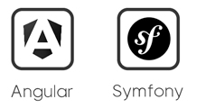
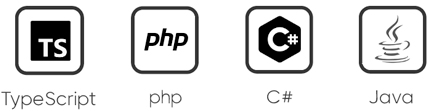
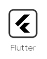
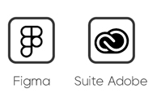
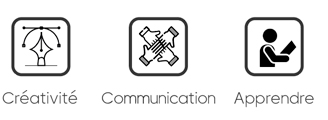
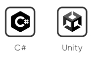

👋 Hi, I’m Mathieu

# **About me**

Originally trained as a Print/Web graphic designer, I worked in Communication and Digital Marketing for almost 19 years. 
This background on the one hand, and my appetite for digital technology, including Human-Computer Interactions on the other hand, 
motivated me to evolve in Application Development.

To achieve this goal, I first set out to develop my skills in digital product design. 
For this, I followed training in UX/UI Design at Ziggourat Paris from April to October 2022. 
Then secondly, I joined a diploma course (level 6/Bac+4) as a Designer Developer of Applications from February 2023 to February 2024.

---

Infographiste Print/Web de formation initiale, j’ai évolué dans la Communication et le Marketing Digital pendant près de 19 ans. 
Ce parcours d’une part, et mes appétences pour le numérique, dont les Interactions Homme-Machine d’autre part, 
m’ont motivé à évoluer dans le Développement d'Applications.

Pour atteindre cet objectif, j’ai tout d’abord entrepris de développer mes compétences en conception de produits numériques. 
Pour cela, j’ai suivi une formation en UX/UI Design à Ziggourat Paris de avril à octobre 2022. 
Puis dans un second temps, j’ai intégré une formation diplômante (niv.6/Bac+4) de Concepteur Développeur d’Applications 
de février 2023 à février 2024.

# **My stack (for now...)**

## **Frameworks**

## **Languages**

## **Mobile**

        
## **Prototype**

## **Soft Skills**

# **Other**

## **During my free time**

