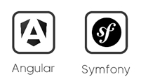
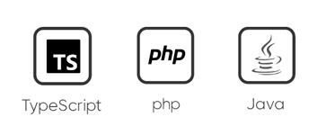
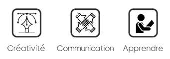
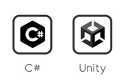

👋 Hi, I’m Mathieu

# **About**

Originally trained as a Print/Web graphic designer, I worked in Communication and Digital Marketing for almost 19 years. 
This background on the one hand, and my appetite for digital technology, including Human-Computer Interactions on the other hand, 
motivated me to evolve in Application Development.

To achieve this goal, I first set out to develop my skills in digital product design. 
For this, I followed training in UX/UI Design at Ziggourat Paris from April to October 2022. 
Then secondly, I joined a diploma course (level 6/Bac+3) as a Designer Developer of Applications from February 2023 to February 2024.

# **Stack**

## **Frameworks**

## **Mobile**

        
## **Languages**

        
## **Prototype**

## **Soft Skills**

# **Other**

## **During my free time**

